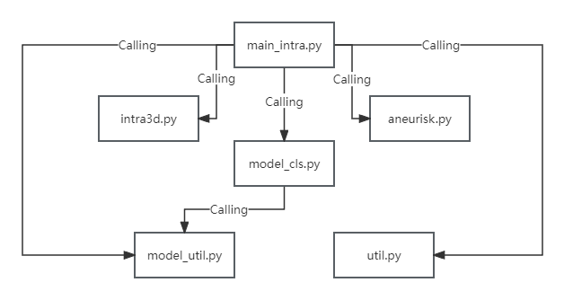

## Introduction
This project comes from the report "Machine Learning Classification of Aneurysms Using Imaging and Simulation Data". Three experiments were mentioned in this report:  
* Experiment 1: Detection of intracranial aneurysms;  
* Experiment 2: Risk prediction of intracranial aneurysm rupture;  
* Experiment 3: Prediction of outcomes for patients with posterior communicating artery(PComA) aneurysm after receiving flow diverter (FD) treatment.  

The purpose of this project is to implement the deep learning model in Experiment 1 and Experiment 2 mentioned above.

## Configuration Environment

* Python 3.7
* Pytorch 1.6
* CUDA 10.0
* Packages: tqdm, sklearn, visualdl, einops, natsort, pandas, numpy, math, os, numpy_stl, sys, glob, scikit-learn, tqdm. 
* Install pointnet++ library:
    ```
    pip install pointnet2_ops_lib/.  
    ```
  <b>NOTE:</b> If there is a problem executing this command, please go to  [Pointnet2_PyTorch](https://github.com/erikwijmans/Pointnet2_PyTorch) to find a solution.


## Data
The IntrA dataset can be downloaded from [intra3d2019](https://github.com/intra3d2019/IntrA), and location of the IntrA dataset is ```data/IntrA3D```.


The Aneurisk dataset can be downloaded from [Aneurisk](http://ecm2.mathcs.emory.edu/aneuriskweb), and the location of the Aneurisk dataset is ```data/Aneurisk```.


## Model Training Instructions

  ```
  Training transformer Intra3D
  python main_intra.py --exp_name intra_cls_train --mode train --num_points 1024 --lr 0.01 --use_sgd True --num_K 32 64
  Training Deep Brief Network(DBN), Intra3D
  python main_intra.py --exp_name dbn_intra_train --mode train --num_points 1024 --lr 0.01 --use_sgd True --num_K 32 64
  Training transformer Aneurisk
  python main_intra.py --exp_name aneurisk_train --mode train --num_points 1024 --lr 0.01 --use_sgd True --num_K 32 64
  Training transformer Aneurisk
  python main_intra.py --exp_name dbn_aneurisk_train --mode train --num_points 1024 --lr 0.01 --use_sgd True --num_K 32 64
  
  When testing, simply set the mode to test
  ```

## File Relationship Diagram


## References
[1] AneuriskTeam. 2012. AneuriskWeb. [Online]. [Accessed 25 June 2023]. Available from: http://ecm2.mathcs.emory.edu/aneuriskweb  
[2] Yu, J., Zhang, C., Wang, H., Zhang, D., Song, Y., Xiang, T., Liu, D., Cai, W. 2021. 3D Medical Point Transformer: Introducing Convolution to Attention Networks for Medical Point Cloud Analysis. arXiv preprint arXiv:2112.04863. Available from: https://github.com/intra3d2019/IntrA  
[3] [3DMedPT](https://github.com/crane-papercode/3DMedPT?tab=readme-ov-file)  
[4] [lambda-network](https://github.com/lucidrains/lambda-networks)  
[5] [Pointnet_Pointnet2_pytorch](https://github.com/yanx27/Pointnet_Pointnet2_pytorch)  
[6] [dgcnn.pytorch](https://github.com/AnTao97/dgcnn.pytorch)