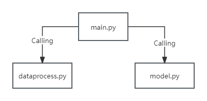

## Introduction
This project comes from the report "Machine Learning Classification of Aneurysms Using Imaging and Simulation Data". Three experiments were mentioned in this report:  
* Experiment 1: Detection of intracranial aneurysms;  
* Experiment 2: Risk prediction of intracranial aneurysm rupture;  
* Experiment 3: Prediction of outcomes for patients with posterior communicating artery(PComA) aneurysm after receiving flow diverter (FD) treatment.  

The purpose of this project is to implement the machine learning model in Experiment 2 and Experiment 3 mentioned above.

## Configuration Environment
* Python 3.7
* Pytorch 1.6
* CUDA 10.0
* Packages: tqdm, sklearn, visualdl, einops, natsort, pandas, numpy, math, os, numpy_stl, sys, glob, scikit-learn, tqdm, joblib. 

## Data
* The location of the @neurIST dataset is ```processed/AneurIST```.

* The location of the FD-PASS dataset is ```processed/fd```.

<b>NOTE:</b> Due to the fact that the "@neurIST" and "FD-PASS" datasets used in this project are non-public. Therefore, for the protection of academic research results, these two datasets will not be publicly accessed.

## Project operation
* Directly run the "main.py" file.

## File Relationship Diagram





## References
[1] Boeker, M., Stenzhorn, H., Kumpf, K., Bijlenga, P., Schulz, S., Hanser, S. 2007. The @neurIST ontology of intracranial aneurysms: providing terminological services for an integrated IT infrastructure. AMIA Annu Symp Proc. 2007:56-60.

[2] Sarrami-Foroushani, A., Lassila, T., MacRaild, M. et al. 2021. In-silico trial of intracranial flow diverters replicates and expands insights from conventional clinical trials. Nat Commun 12, 3861 (2021).
